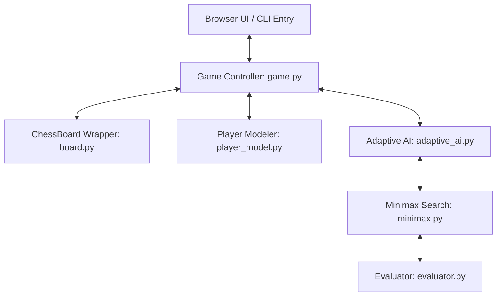

#  AdaptoAlgo-Chess (Adaptive Engine & Architecture Guide)

A fully-featured chess AI utilizing minimax search, player modeling, and real-time behavioral adaptation. The project features a terminal-based Python interface as well as an entirely self-contained, interactive web-based frontend.


## Project Structure

```
ai_chess_bot/
├── main.py                  # CLI entry point
├── game.py                  # Top-level game controller
├── requirements.txt
│
├── engine/
│   ├── __init__.py
│   └── board.py             # Chess board wrapper (python-chess)
│
├── ai/
│   ├── __init__.py
│   ├── evaluator.py         # Position evaluation function
│   ├── minimax.py           # Minimax + alpha-beta + quiescence
│   └── adaptive_ai.py       # Adaptive difficulty & style module
│
├── player/
│   ├── __init__.py
│   └── player_model.py      # Player profiling & learning system
│
├── ui/
│   └── chess_ui.html        # Browser-based interactive chessboard
│
└── data/
    └── player_profile.json  # Persistent player profile (auto-created)
```

## System Architecture

The codebase separates chess rules, strategic evaluation, game tree search, user behavior tracking, and front-end interaction:


---
## 🎮 The Two Ways to Play

This repository provides two completely independent game modes.

### 🌐 1. Browser Mode (Zero-Server, Pure JavaScript)

Open ```ui/chess_ui.html``` in any modern browser — no server required!

- Click pieces to select, click destination to move
- Or type moves in the input box (UCI format)
- Full adaptive AI runs client-side in JavaScript


* **No Server Needed**: Runs a fully ported version of the Python chess rules, minimax search, and adaptive AI directly inside the browser's JavaScript engine.
* **How it Works Synchronously**: When you make a move, the browser's thread intercepts your interaction, calculates legal moves, performs the Negamax algorithm, updates the UI, and saves your profile to browser `localStorage` synchronously.


---


### 💻 2. CLI Mode (Terminal-Based Python)
Run the game using Python directly from your terminal:
```bash
python main.py
```
* **How it Works**: CMD runs `main.py` which coordinates the Python scripts (`game.py`, `board.py`, etc.). It displays the chess board in colored ASCII text and takes your moves in UCI format (e.g. `e2e4`, `g1f3`). Your profile is saved persistently on your computer under `data/player_profile.json`.

**CLI commands:**
| Input       | Action            |
|-------------|-------------------|
| `e2e4`      | Make a move (UCI) |
| `r`         | Resign            |
| `d`         | Offer draw        |
| `u`         | Undo last move    |
| `q`         | Quit              |

### Setup & Requirements
To run CLI mode, simply install the `python-chess` dependency:
```bash
pip install python-chess
```
To run Browser mode, just double-click `chess_ui.html`—no installation required!


---

## Behind the Scenes: Classical AI vs. Modern Machine Learning

This engine is **Classical Algorithmic AI** (Search and Heuristics),it relies on mathematical game theory:
1. **Iterative Deepening Negamax**: Explores a tree of all possible moves, working progressively deeper until a time threshold is hit.
2. **Alpha-Beta Pruning**: Mathematically eliminates branches that are guaranteed to be worse than already-searched moves.
3. **Move Ordering (MVV-LVA)**: Orders captures based on *Most Valuable Victim - Least Valuable Attacker* to speed up alpha-beta pruning.
4. **Quiescence Search**: Extends search during highly tactical capturing sequences to prevent the *horizon effect* (blundering just out of sight).
5. **Static Positional Evaluation**: Scores a board position in centipawns by evaluating:
   * **Material**: Pawns (100), Knights (320), Bishops (330), Rooks (500), Queens (900).
   * **Piece-Square Tables (PST)**: Positioning bonuses for development, king safety, or central space.
   * **Mobility**: Extra centipawns for active choices.
   * **Pawn Structure & King Safety**: Penalizes doubled/isolated pawns and vulnerable king positions.

---

## Real-Time Adaptation

The engine adapts its difficulty and playstyle to match the user through **Exponential Moving Average (EMA)** statistics

### Player Modeling

After each game, the system updates a persistent `PlayerProfile`:

| Metric           | How it's tracked                              |
|------------------|-----------------------------------------------|
| **Aggression**   | Captures / total moves ratio (EMA update)     |
| **Mistake rate** | Frequency of suspicious fast moves            |
| **Avg move time**| Seconds per move (rolling average)            |
| **Win rate**     | Wins / total games                            |
| **Tactical tendency** | Checks given / total moves              |

All metrics use **Exponential Moving Average** (α=0.2), so recent games influence the profile more than old ones.

### Adaptive AI Response

Based on the player profile, the AI dynamically adjusts:

| Player Trait          | AI Response                                  |
|-----------------------|----------------------------------------------|
| High aggression       | Plays **defensively**, focuses on king safety |
| Low aggression        | Plays **aggressively**, attacks and pressures |
| High win rate (>60%)  | Increases search **depth** (gets harder)     |
| Low win rate (<35%)   | Decreases search **depth** (gets easier)     |
| Many mistakes         | Simulates its own **mistakes** to balance    |
| Endgame reached       | **Increases depth** & reduces mistake prob   |

### Evaluation Function Components

| Component        | Weight                      |
|------------------|-----------------------------|
| Material         | Exact piece values          |
| Piece-square     | Position bonuses per piece  |
| Mobility         | +3 per extra legal move     |
| King safety      | Pawn shield + attacker penalty |
| Center control   | +15 per attacked center sq  |
| Pawn structure   | Doubled/isolated penalties  |

### Minimax Search

- **Algorithm**: Negamax with alpha-beta pruning
- **Move ordering**: Captures first (MVV-LVA), then checks, then quiet
- **Quiescence search**: Extends captures-only to avoid horizon effect
- **Iterative deepening**: Searches deeper until time limit
- **Time limit**: 5 seconds per move (configurable)

---

## Difficulty Levels

| Level     | Depth | Mistake Prob | Notes                    |
|-----------|-------|-------------|--------------------------|
| Beginner  | 1     | 40%         | Often plays random moves |
| Easy      | 2     | 20%         | Sees 2 moves ahead       |
| Medium    | 3     | 8%          | Solid play               |
| Hard      | 4     | 2%          | Strong, rare mistakes    |
| Expert    | 5     | 0%          | Near-optimal             |
| Adaptive  | 3±    | 10%±        | Changes based on you     |


## Conclusion

**AdaptoAlgo-Chess** is a highly successful demonstration of combining **classical game theory** with **real-time behavioral analytics** to create an engaging, personalized user experience. By merging lightweight graph-search with automated player profiling, the project provides a highly challenging, yet fair, chess opponent without the massive computational overhead of modern neural networks.


